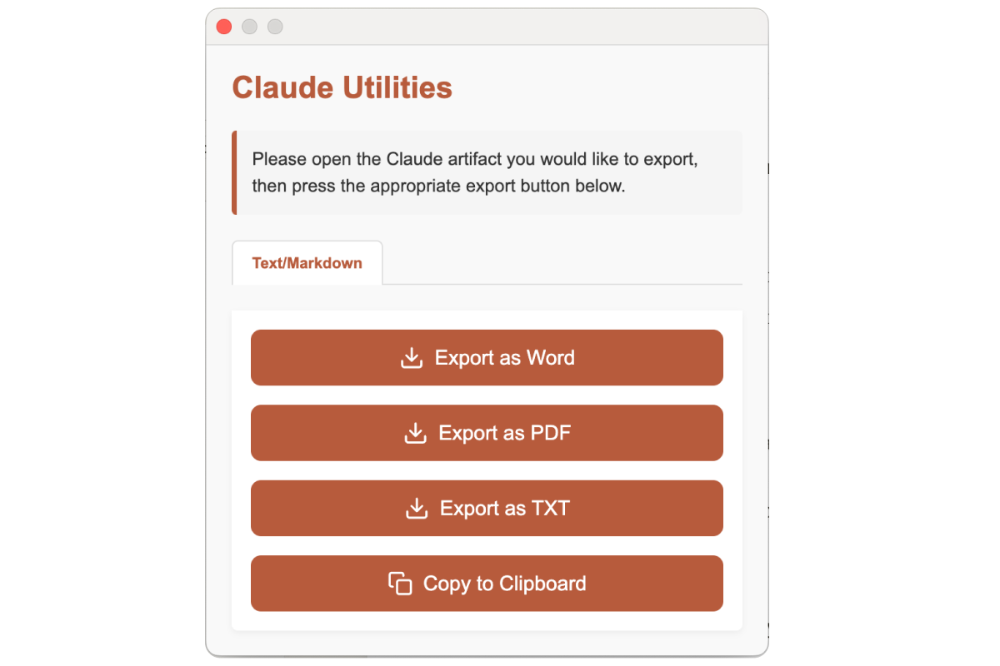

# Claude Artifact Expander

A Chrome extension to enhance Claude's artifact panel with resizing, fullscreen, and export capabilities.



## Features

- Adjust panel width with pixel precision
- Toggle fullscreen mode
- Export content as PNG with automatic clipboard copy
  - Saves PNG file to downloads
  - Automatically copies the same image to clipboard for easy pasting
- Export content as Word document
- Visual width indicator
- One-click reset

## Extension Icon


## Installation

### From Source
1. Clone this repository:
   ```bash
   git clone https://github.com/yourusername/claude-artifact-expander.git
   ```

2. Open Chrome and navigate to `chrome://extensions/`

3. Enable "Developer mode" in the top right corner

4. Click "Load unpacked" and select the extension directory

### Usage

1. Open Claude in Chrome
2. Click the extension icon in the toolbar
3. Use the controls to:
   - Adjust panel width using the input field and Resize button
   - Reset to default width using Reset button
   - Toggle fullscreen mode
   - Export content:
     - PNG: Saves file and copies to clipboard automatically
     - Word: Exports formatted document

## Privacy

For information about data handling and privacy, please see our [Privacy Policy](PRIVACY.md).

## Development

The extension is built using:
- Chrome Extension Manifest V3
- Vanilla JavaScript
- Chrome Extension APIs

### Project Structure
```
claude-artifact-expander/
├── icons/                 # Extension icons
│   ├── icon-16.png
│   ├── icon-32.png
│   ├── icon-48.png
│   ├── icon-128.png
│   └── icon-256.png
├── assets/               # Documentation assets
│   └── screenshots/
│       └── screenshot-1.png
├── manifest.json         # Extension manifest
├── popup.html           # Extension popup UI
├── popup.js             # Popup functionality
└── README.md           # This file
```

## License

MIT License - see LICENSE file for details

## Author

Mehran Mozaffari